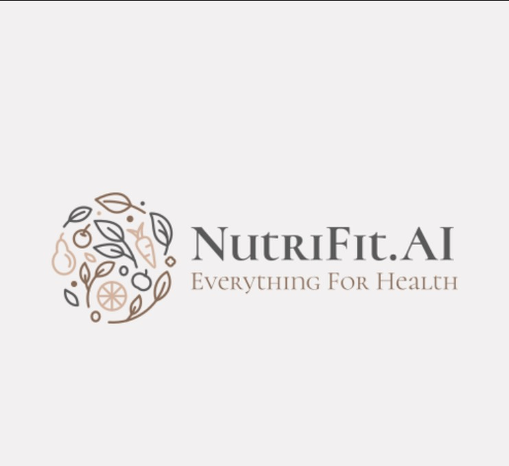

# 🥗 NutriFit - AI-Powered Wellness Hub

<div align="center">



**Your Personal AI-Powered Nutrition and Fitness Companion**

[](https://www.python.org/)
[](https://fastapi.tiangolo.com/)
[](https://streamlit.io/)
[](LICENSE)

</div>

---

## 🌟 Overview

NutriFit is a comprehensive wellness application that combines AI technology with nutrition science to provide personalized health guidance. Built with modern Python frameworks and powered by Google Gemini AI, it offers real-time BMI calculation, personalized nutrition plans, fitness tracking, and an intelligent chatbot assistant.

## ✨ Key Features

### 🤖 AI-Powered Personalization
- **Personalized Nutrition Plans**: Get detailed, AI-generated nutrition strategies based on your BMI, age, gender, and fitness goals
- **Real-time BMI Calculator**: Instant BMI calculation with color-coded health categories
- **AI Wellness Coach**: Chat with an intelligent assistant for nutrition and fitness guidance
- **Smart Recommendations**: BMI-specific food suggestions for all meals

### 👤 User Profile System
- **Comprehensive Profiles**: Track weight, height, age, gender, and fitness goals
- **Secure Authentication**: Powered by Supabase with Row Level Security (RLS)
- **Profile Dashboard**: View your health metrics at a glance
- **Privacy First**: Your data is encrypted and only accessible to you

### 🍽️ Nutrition & Fitness
- **Meal Planning**: Detailed breakfast, lunch, dinner, and snack recommendations
- **Calorie Tracking**: Personalized calorie recommendations based on your profile
- **Macronutrient Breakdown**: Protein, carbs, and fats tailored to your goals
- **Supplement Suggestions**: AI-recommended supplements based on your needs
- **Fitness Tracker**: Log workouts and monitor progress

### 🩺 Health Analysis
- **Medical Report OCR**: Upload lab reports and get AI-powered insights
- **Health Metrics**: Track weight, hydration, and calorie intake over time
- **Visual Analytics**: Beautiful charts and graphs for progress tracking

### 🎨 Beautiful UI/UX
- **Modern Design**: Gradient backgrounds with smooth animations
- **Dark Theme**: Easy on the eyes with a professional look
- **Responsive Layout**: Works seamlessly on desktop and mobile
- **Intuitive Navigation**: Easy-to-use sidebar navigation

---

## 🏗️ Architecture

```
NutriFit/
├── backend/
│   ├── main.py                 # FastAPI server & API endpoints
│   ├── auth.py                 # Supabase authentication service
│   ├── profile_service.py      # User profile CRUD operations
│   ├── gemini_service.py       # Google Gemini AI integration
│   ├── health_report.py        # Medical report OCR processing
│   ├── schemas.py              # Pydantic models
│   └── database.sql            # Database schema
│
├── frontend/
│   ├── app.py                  # Main Streamlit application
│   ├── pages/
│   │   ├── 1_🔐_Login.py      # Login page
│   │   └── 2_📝_Register.py   # Registration with profile
│   └── nutrifit_logo.jpg       # App logo
│
├── requirements.txt            # Python dependencies
├── render.yaml                 # Render deployment config
├── .env.example                # Environment variables template
├── .gitignore                  # Git ignore rules
└── README.md                   # This file
```

---

## 🚀 Quick Start

### Prerequisites
- Python 3.11 or higher
- Supabase account (free tier available)
- Google Gemini API key (free tier available)

### 1. Clone the Repository
```bash
git clone https://github.com/YOUR_USERNAME/NutriFit.git
cd NutriFit
```

### 2. Create Virtual Environment
```bash
python -m venv venv

# Windows
venv\Scripts\activate

# macOS/Linux
source venv/bin/activate
```

### 3. Install Dependencies
```bash
pip install -r requirements.txt
```

### 4. Set Up Environment Variables
Create a `.env` file in the root directory:
```env
# Supabase Configuration
SUPABASE_URL=your_supabase_url_here
SUPABASE_API_KEY=your_supabase_anon_key_here

# Gemini AI Configuration
GEMINI_API_KEY=your_gemini_api_key_here

# API Configuration
API_URL=http://localhost:8000
```

### 5. Set Up Database
1. Go to your Supabase project dashboard
2. Navigate to SQL Editor
3. Run the SQL from `backend/database.sql`
4. Run the SQL from `SETUP_DATABASE.md` to create the `user_profiles` table

### 6. Run the Application

**Terminal 1 - Backend:**
```bash
python -m uvicorn backend.main:app --reload
```

**Terminal 2 - Frontend:**
```bash
streamlit run frontend/app.py
```

### 7. Access the App
- **Frontend:** http://localhost:8501
- **Backend API:** http://localhost:8000
- **API Docs:** http://localhost:8000/docs

---

## 📡 API Endpoints

### Authentication
- `POST /auth/signup` - Register new user
- `POST /auth/login` - User login
- `POST /auth/logout` - User logout

### Profile Management
- `POST /profile/create` - Create user profile
- `POST /profile/get` - Get user profile
- `PUT /profile/update` - Update user profile

### AI Services
- `POST /recommend` - Generate personalized nutrition plan
- `POST /ai_chat` - Chat with AI wellness coach
- `POST /ocr` - Analyze medical reports

### Health
- `GET /health` - API health check

---

## 🎮 How to Use

### 1. Register Your Account
1. Click **"Register"** in the sidebar
2. Fill in your account details (name, email, password)
3. Add your personal information:
   - Weight (kg)
   - Height (cm)
   - Age
   - Gender
   - Fitness Goal
4. Watch your BMI calculate in real-time! 🧮
5. Click **"Get AI Advice"** for instant health tips
6. Create your account

### 2. Generate Your Nutrition Plan
1. Navigate to **"Nutrition Plan"**
2. View your profile summary
3. Click **"Generate Personalized Plan"**
4. Wait 5-10 seconds
5. Get your detailed, personalized nutrition strategy! 🎉

### 3. Track Your Fitness
1. Go to **"Fitness Tracker"**
2. Log your workouts
3. Monitor your progress with visual charts

### 4. Chat with AI Coach
1. Visit **"AI Chat"**
2. Ask questions about nutrition and fitness
3. Get evidence-based, actionable advice

### 5. Analyze Medical Reports
1. Go to **"Medical Report"**
2. Upload your lab reports (PNG, JPG, PDF)
3. Get AI-powered insights

---

## 🔧 Configuration

### Get Your API Keys

#### Supabase:
1. Go to https://supabase.com
2. Create a new project
3. Go to Settings → API
4. Copy your `URL` and `anon/public` key

#### Google Gemini:
1. Go to https://makersuite.google.com/app/apikey
2. Create a new API key
3. Copy your API key

---

## 🚀 Deployment

### Deploy to Render

See detailed instructions in `DEPLOYMENT_GUIDE.md`

**Quick Steps:**
1. Push code to GitHub
2. Connect GitHub to Render
3. Use the `render.yaml` blueprint
4. Add environment variables
5. Deploy!

**Free Tier Available** ✅

---

## 🧪 Testing

Run the test suite:
```bash
# Test nutrition plan generation
python test_nutrition_plan.py

# Test implementation
python test_implementation.py

# Test authentication
python test_auth.py
```

---

## 📊 Tech Stack

### Backend
- **FastAPI** - Modern, fast web framework
- **Python 3.11+** - Programming language
- **Uvicorn** - ASGI server
- **Supabase** - Database & authentication
- **Google Gemini AI** - AI-powered recommendations

### Frontend
- **Streamlit** - Interactive web app framework
- **Plotly** - Data visualization
- **Requests** - HTTP client

### AI & ML
- **Google Gemini 2.0 Flash** - Large language model
- **EasyOCR** - Optical character recognition
- **Tesseract** - Text extraction

### Database
- **PostgreSQL** (via Supabase) - Relational database
- **Row Level Security** - Data protection

---

## 📈 Features Roadmap

### ✅ Completed
- User authentication & authorization
- User profile system with BMI calculation
- Real-time BMI calculator
- AI-powered personalized nutrition plans
- AI wellness coach chatbot
- Fitness tracking
- Medical report OCR analysis
- Beautiful, modern UI

### 🚧 In Progress
- Weight tracking over time
- BMI history visualization
- Profile editing functionality
- Meal logging

### 📋 Planned
- Mobile app (React Native)
- Social features (share progress)
- Recipe database
- Barcode scanner for food items
- Integration with fitness trackers
- Meal prep planning
- Shopping list generator
- Progress photos
- Community challenges

---

## 🤝 Contributing

Contributions are welcome! Here's how:

1. **Fork the repository**
2. **Create a feature branch**
   ```bash
   git checkout -b feature/AmazingFeature
   ```
3. **Commit your changes**
   ```bash
   git commit -m "Add some AmazingFeature"
   ```
4. **Push to the branch**
   ```bash
   git push origin feature/AmazingFeature
   ```
5. **Open a Pull Request**

---

## 📝 Documentation

- **[Quick Start Guide](START_HERE.md)** - Get started in 2 minutes
- **[Deployment Guide](DEPLOYMENT_GUIDE.md)** - Deploy to Render
- **[GitHub Push Guide](GITHUB_PUSH.md)** - Push to GitHub
- **[Setup Database](SETUP_DATABASE.md)** - Database setup instructions
- **[Implementation Complete](IMPLEMENTATION_COMPLETE.md)** - Full feature documentation
- **[Nutrition Plan Fix](NUTRITION_PLAN_FIX.md)** - Recent bug fixes

---

## 🐛 Troubleshooting

### Common Issues

**Backend won't start:**
- Check Python version (3.11+ required)
- Verify all dependencies installed: `pip install -r requirements.txt`
- Check environment variables in `.env`

**Frontend can't connect to backend:**
- Ensure backend is running on port 8000
- Verify `API_URL` in `.env` is correct
- Check CORS settings in `backend/main.py`

**Nutrition plan shows error:**
- Verify `GEMINI_API_KEY` is set correctly
- Check Gemini API quota
- See `NUTRITION_PLAN_FIX.md` for details

**Authentication fails:**
- Verify Supabase credentials
- Check database tables are created
- Ensure RLS policies are set up

---

## 📄 License

This project is licensed under the MIT License - see the [LICENSE](LICENSE) file for details.

---

## 🙏 Acknowledgments

- **Google Gemini AI** - For powerful AI capabilities
- **Supabase** - For excellent backend infrastructure
- **Streamlit** - For making beautiful web apps easy
- **FastAPI** - For the amazing web framework
- **The Open Source Community** - For all the amazing tools

---

## 📞 Support

- **Issues:** [GitHub Issues](https://github.com/YOUR_USERNAME/NutriFit/issues)
- **Discussions:** [GitHub Discussions](https://github.com/YOUR_USERNAME/NutriFit/discussions)
- **Email:** your.email@example.com

---

## 🌟 Star History

If you find this project useful, please consider giving it a ⭐!

---

<div align="center">

**Made with ❤️ and 🤖 AI**

**Happy Wellness Journey! 🥗💪🏃‍♂️**

</div>